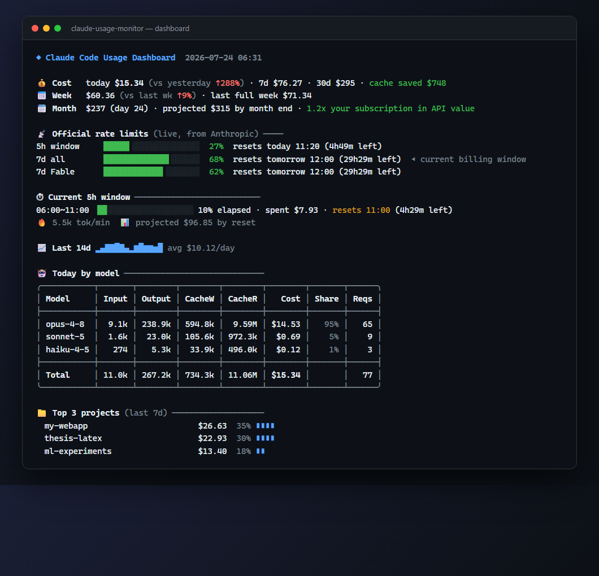
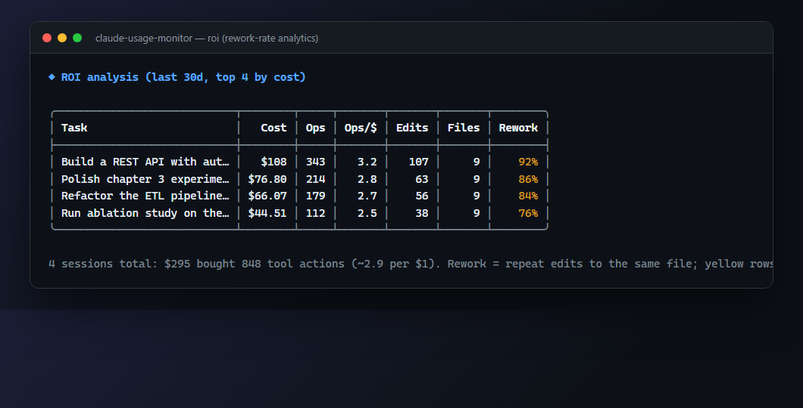
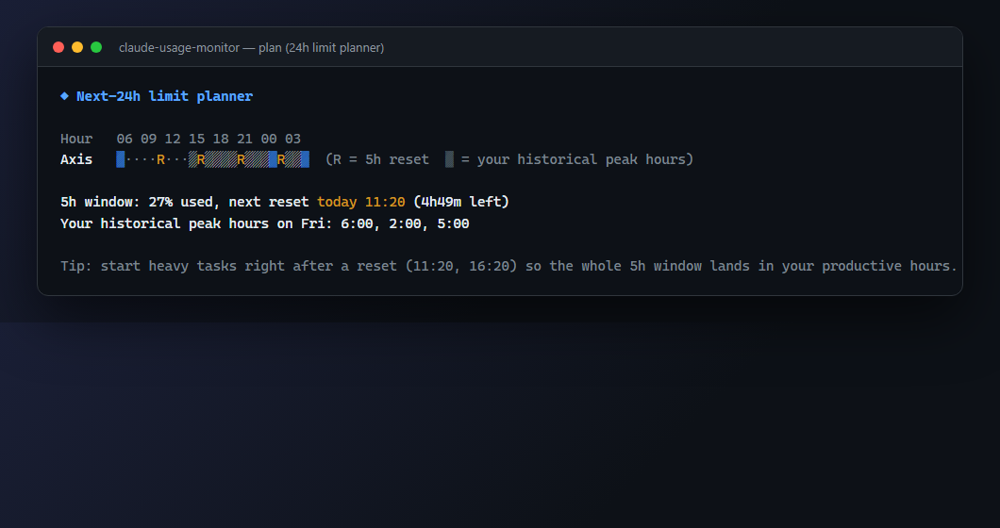
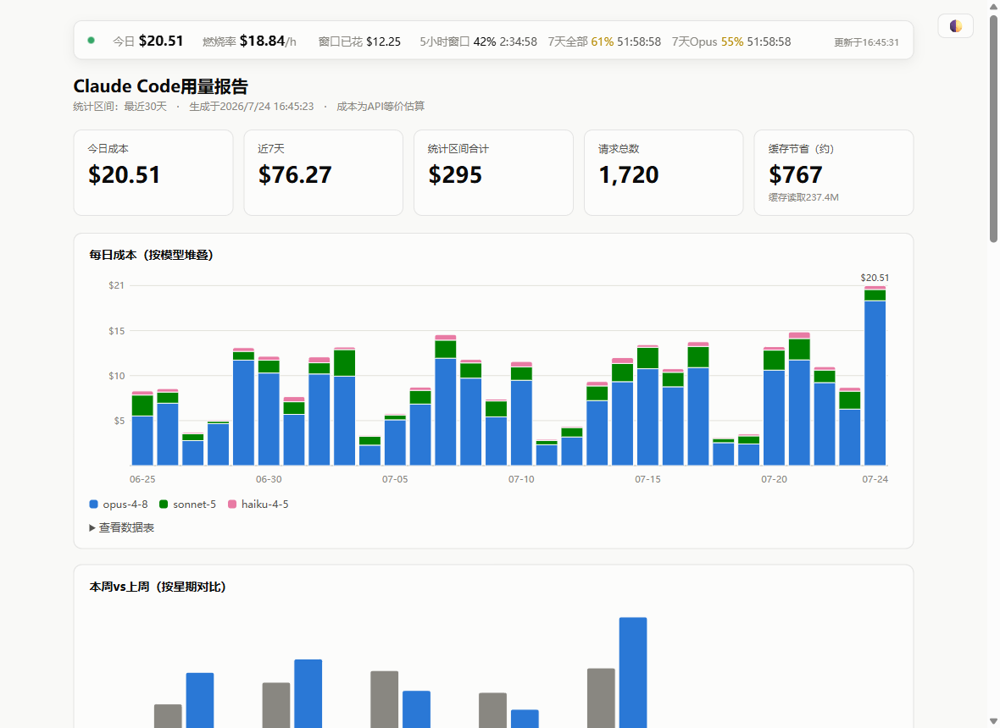
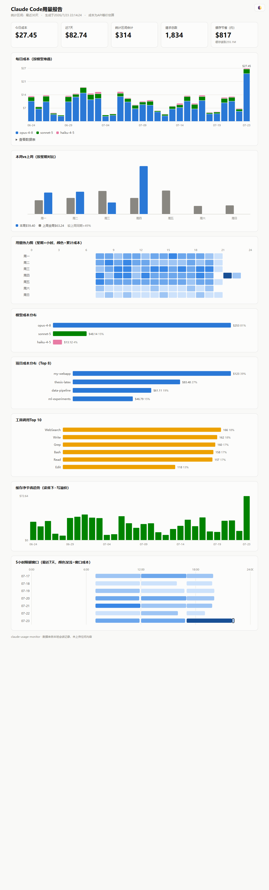
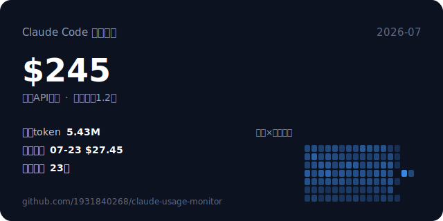

<div align="center">

# claude-usage-monitor

**Reads your real Anthropic rate limits (5h / 7d / per-model weekly) instead of estimating them — then goes further: per-task cost attribution, subagent (Task/Workflow) spend accounting, rework-rate ROI analytics, session receipts, an optional daily-budget hard-stop, and a live local web dashboard. Zero dependencies, English & Chinese output.**

[](LICENSE)
[](package.json)
[](package.json)
[](https://github.com/1931840268/claude-usage-monitor/releases)

[中文文档（完整版）](README_zh.md) · Output language auto-detects your locale (`--lang en|zh` to override).


<br/><sub>All screenshots use synthetic demo data — your real data never leaves your machine.</sub>

</div>

## Quick start

```bash
# Try it in ~15 seconds, nothing to install.
# (npx supports GitHub specifiers: this clones the repo and runs its bin — zero deps, ~120KB of auditable .mjs)
npx github:1931840268/claude-usage-monitor all
```

```bash
# Full plugin install: 26 slash commands + 4 lifecycle hooks + statusline + 19 MCP tools
claude plugin marketplace add 1931840268/claude-usage-monitor
claude plugin install usage-monitor@usage-monitor-market
```

Then inside Claude Code: `/usage-monitor:usage` for the dashboard, `/usage-monitor:advise` for personalized savings tips.

## How it compares

Honest version, checked against both projects' docs on 2026-07-24. [ccusage](https://github.com/ryoppippi/ccusage) (17k+ stars) and [Claude Code Usage Monitor](https://github.com/Maciek-roboblog/Claude-Code-Usage-Monitor) (8k+ stars) are excellent, mature tools — if you want a battle-tested multi-agent cost CLI or a rich live TUI, use them. This plugin trades their maturity and breadth for analysis depth and plugin-native automation:

| Capability | ccusage | Usage Monitor | this plugin |
| --- | :-: | :-: | :-: |
| Maturity, community, release count | **17k+ stars** | **8k+ stars** | day one |
| Multi-agent coverage (Codex, Gemini CLI, …) | **16 sources** | – | Claude Code only |
| Statusline integration | ✓ (Beta) | ✓ (`--statusline`) | ✓ |
| Actively queries the official usage API¹ | – | passive capture² | ✓ per-model weekly + reset times |
| Per-task attribution (sessions titled by what you asked) | – | – | ✓ |
| ROI analytics: actions per $, rework rate | – | – | ✓ |
| Advice engine (cache health, context bloat, model mix) | – | – | ✓ |
| 24h limit planner (resets × your peak hours) | – | – | ✓ |
| Scheduled briefings³ (daily/weekly, auto-archived HTML) | – | – | ✓ via SessionStart hook |
| Ships as a Claude Code plugin (slash commands + hooks + MCP) | – | – | ✓ 26 cmds, 19 MCP tools |
| Runtime | native binary via npx/bunx | Python + pip | reuses Claude Code's own Node |

¹ Requires a Pro/Max subscription (OAuth). API-key accounts have no rate-limit data — the plugin falls back to ccusage-compatible local window estimates. ccusage parses limit-reset timestamps from transcripts after you hit a limit, but does not query quota utilization.
² Usage Monitor captures the official `rate_limits` that Claude Code passes to statusline hooks (5h/7d); when captures go stale it falls back to labeled P90 estimates. It does not query the API directly and has no per-model weekly quotas.
³ Both tools have on-demand daily/weekly report commands; neither pushes scheduled briefings into your session or archives HTML reports automatically.

## What it looks like

| ROI — what did each dollar buy | 24h limit planner |
| --- | --- |
|  |  |

<details>
<summary><b>Live local web dashboard (<code>usage serve</code>) — ticking limit countdowns, burn rate, auto-refresh via SSE (report UI is Chinese-first for now)</b></summary>

</details>

<details>
<summary><b>Zero-dependency HTML report (8 charts, light/dark, theme toggle)</b></summary>

</details>

<details>
<summary><b>Shareable monthly card (SVG, generated locally)</b></summary>

</details>

## Feature map

- **Official truth** — `limits` (real quotas + reset times + exit codes for scripting), `blocks` (ccusage-compatible 5h windows), time-to-limit ETA, rate-limit hit markers, plus a **StopFailure black box**: a hook records every real rate-limit/overload abort, so `limits`/`errors` show prediction *and* reality.
- **Deep analytics** — `agents` (subagent/Task/Workflow spend attribution with per-session fan-out drill-down), `sessions` (task titles), `roi` (rework rate), `context` (context-size cost bands), `hours` (weekday×hour heatmap), `errors` (API failure taxonomy), `tools`, `projects`, `cache`.
- **Session receipts** — a SessionEnd hook settles every session into a receipt (cost, active time, edits, rework rate, cache hit rate, why it ended); `last` shows it, and the next session greets you with a one-line summary.
- **Budget guard** — soft warning at 80% of `daily_budget_usd`; opt-in `budget_hard_cap` blocks new prompts once you're over (fails open on any error).
- **Decisions, not just numbers** — `advise` engine, `plan` 24h timeline, monthly forecast + subscription-value multiple on the dashboard.
- **Automation** — 4 lifecycle hooks (SessionStart brief/recap/limit warnings, SessionEnd receipts, StopFailure black box, UserPromptSubmit budget guard), background multi-device sync, statusline with anomaly burn sentinel.
- **Live views** — `serve` local web dashboard (127.0.0.1-only, SSE auto-refresh, ticking countdowns), `live` terminal dashboard.
- **Integrations** — 26 slash commands, 19 MCP tools (`usage_dashboard`, `usage_agents`, `usage_last`, …), `--json` everywhere, `--csv` exports, `card` monthly SVG, `doctor` self-check.
- **Team & fleet** — folder-based auto sync (`sync_dir`), per-device/member `team` view, strict import sanitization.

Language: core commands (`all`, `today`, `limits`, `blocks`, `roi`, `plan`, statusline, help) are fully localized (en/zh, auto-detected); remaining analytics commands are Chinese-first with English on the [roadmap](ROADMAP.md). Full command reference & configuration: [中文文档](README_zh.md).

## Security & privacy

You should not have to trust a new repo — verify it in 30 seconds:

- **Zero dependencies.** Four plain `.mjs` files, no install scripts, no lockfile to poison.
- **One outbound endpoint.** The only network call is Anthropic's own usage API, using the credentials Claude Code already stores. Check for yourself:

```bash
grep -rn "https://" scripts/   # exactly one hit: api.anthropic.com/api/oauth/usage
```

- Everything else parses local `~/.claude` transcripts. No telemetry, no uploads. The HTML report, monthly card and exports are files on your disk.

## License

[MIT](LICENSE)
